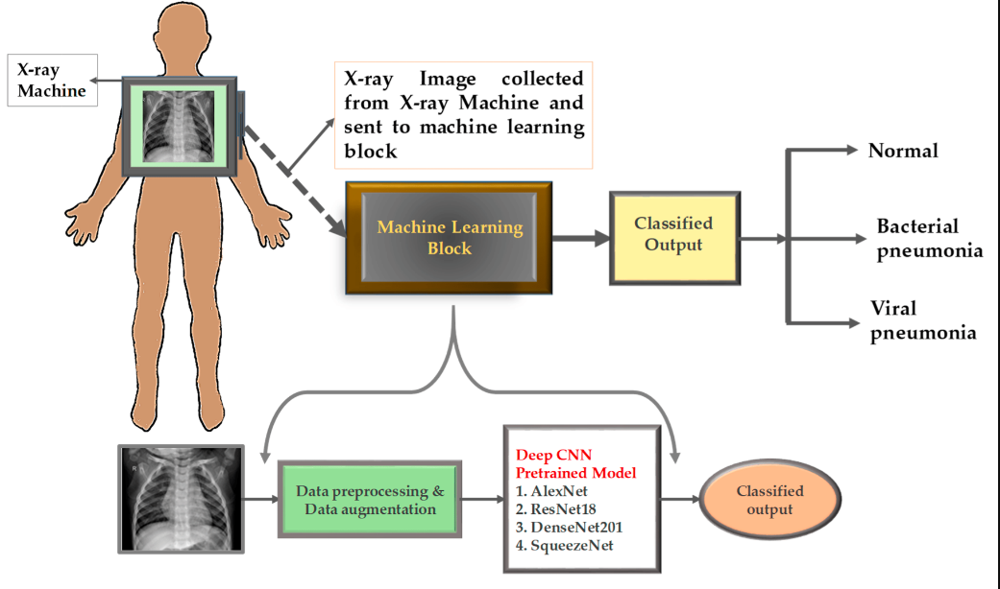
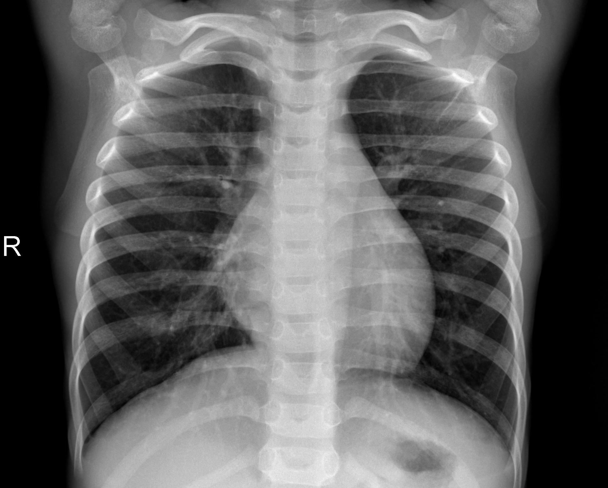

# Pneumonia Disease Detection using Machine Learning (CNN)

## Introduction

This project aims to develop a machine learning model using Convolutional Neural Networks (CNN) to detect pneumonia from chest X-ray images. Pneumonia is a severe lung infection, and early detection is crucial for effective treatment. This project leverages the power of CNNs to automate the detection process, providing a reliable tool for healthcare professionals.



## Installation

1. Clone the repository:
   ```
   git clone https://github.com/bodiwael/Pneumonia-Disease-Detection-using-Machine-Learning-CNN-.git
   cd Pneumonia-Disease-Detection-using-Machine-Learning-CNN-
   ```

2. Create a virtual environment and activate it:
   ```
   python -m venv venv
   source venv/bin/activate   # On Windows, use `venv\Scripts\activate`
   ```

3. Install the required packages:
   ```
   pip install -r requirements.txt
   ```

## Dataset

The dataset used in this project consists of chest X-ray images categorized into two classes: NORMAL and PNEUMONIA. The dataset is divided into training, validation, and test sets. You can download the dataset from (https://data.mendeley.com/datasets/rscbjbr9sj/2).

After downloading, organize the dataset as shown in the project structure.



## Training the Model

To train the CNN model, run the following script:
```
python scripts/train_model.py
```

You can also explore the training process step-by-step using the Jupyter notebook:
```
notebooks/model_training.ipynb
```

## Evaluating the Model

To evaluate the trained model on the test set, run:
```
python scripts/evaluate_model.py
```

The evaluation results, including accuracy and confusion matrix, will be displayed.

## Making Predictions

To make predictions on new chest X-ray images, use the prediction script:
```
python scripts/predict.py --image_path path_to_image
```

This will output the prediction result, indicating whether the input image is NORMAL or shows signs of PNEUMONIA.

## Results

The trained CNN model achieved high accuracy on the test set, demonstrating its effectiveness in detecting pneumonia from chest X-ray images. Below is an example of the model's performance:


## Conclusion

This project successfully demonstrates the application of Convolutional Neural Networks in the medical field, specifically for detecting pneumonia from chest X-rays. The developed model can aid healthcare professionals in early and accurate diagnosis, potentially saving lives.

## License

This project is licensed under the MIT License. See the LICENSE file for details.

## Acknowledgments

We thank the contributors of the chest X-ray pneumonia dataset and the open-source community for their invaluable resources and support.

---

Feel free to reach out if you have any questions or suggestions!
---
